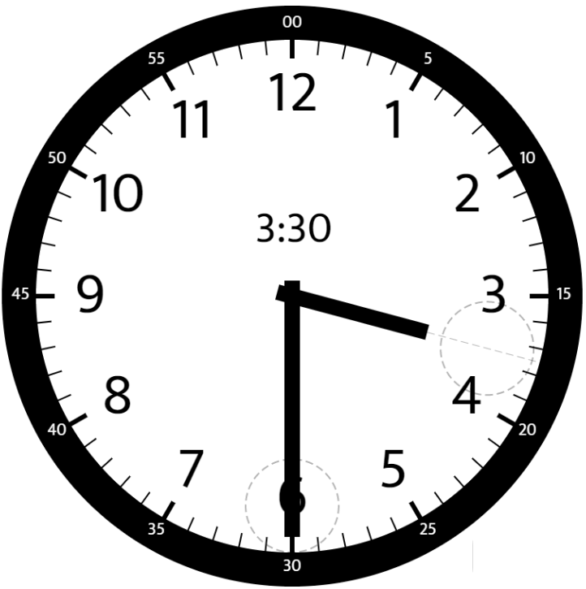
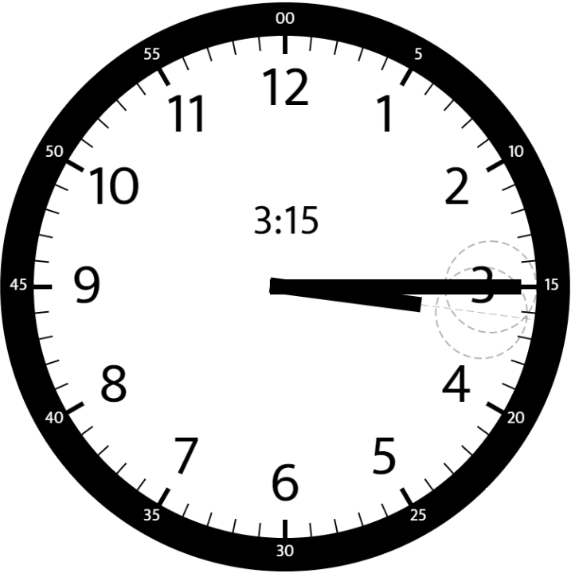

# 1344. Angle Between Hands of a Clock

Given two numbers, hour and minutes, return the smaller angle (in degrees) formed between the hour and the minute hand.

Answers within 10-5 of the actual value will be accepted as correct.

[]()
### Example 1
```sh
Input: hour = 12, minutes = 30
Output: 165
```

[]()
### Example 2
```sh
Input: hour = 3, minutes = 30
Output: 75
```

[]()
### Example 3
```sh
Input: hour = 3, minutes = 15
Output: 7.5
```

### Constraints
```sh
1 <= hour <= 12
0 <= minutes <= 59
```
