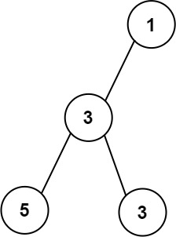

# 662. Maximum Width of Binary Tree

Given the root of a binary tree, return the maximum width of the given tree.

The maximum width of a tree is the maximum width among all levels.

The width of one level is defined as the length between the end-nodes (the leftmost and rightmost non-null nodes), where the null nodes between the end-nodes are also counted into the length calculation.

[]()
### Example 1
```sh
Input: root = [1,3,2,5,3,null,9]
Output: 4
Explanation: The maximum width existing in the third level with the length 4 (5,3,null,9).
```

[]()
### Example 2
```sh
Input: root = [1,3,null,5,3]
Output: 2
Explanation: The maximum width existing in the third level with the length 2 (5,3).
```

[]()
### Example 2
```sh
Input: root = [1,3,2,5]
Output: 2
Explanation: The maximum width existing in the second level with the length 2 (3,2).
```

### Constraints
```sh
The number of nodes in the tree is in the range [1, 3000].
-100 <= Node.val <= 100
```
