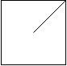

# 959. Regions Cut By Slashes

An n x n grid is composed of 1 x 1 squares where each 1 x 1 square consists of a '/', '\', or blank space ' '. These characters divide the square into contiguous regions.

Given the grid **grid** represented as a string array, return the number of regions.

Note that backslash characters are escaped, so a '\' is represented as '\\'.

[]()
### Example 1
```sh
Input: grid = [" /","/ "]
Output: 2
```

[]()
### Example 2
```sh
Input: grid = [" /","  "]
Output: 1
```

[]()
### Example 3
```sh
Input: grid = ["/\\","\\/"]
Output: 5
Explanation: Recall that because \ characters are escaped, "\\/" refers to \/, and "/\\" refers to /\.
```

### Constraints
```sh
n == grid.length == grid[i].length
1 <= n <= 30
grid[i][j] is either '/', '\', or ' '.
```
